<h1 align="left">
   카라멜(Caramel) - 우리만의 감성 커플 다이어리
</h1>

  
  
   
  
  
   
  
  
   
  
  

 

  
  
  
  
  

## 📖 Overview
💖 사랑하는 연인과의 모든 순간을 한 곳에! 
💕 우리 둘만의 메모부터 일정, 소소한 재미까지 카라멜에서 한 번에 경험할 수 있도록 도와드려요.

📅 한눈에 보는 우리만의 캘린더 
&nbsp;&nbsp;&nbsp;&nbsp;→ 기념일과 데이트는 물론, D-DAY까지 함께 기록하고 공유하는 우리만의 특별한 달력을 만들어보세요. 
📝 둘만의 기록 저장소 
&nbsp;&nbsp;&nbsp;&nbsp;→ 여행지, 영화, 맛집부터 중요한 약속과 투두리스트까지 함께 나누고 언제든 꺼내볼 수 있는 우리만의 기록장을 만들어보세요. 
⚖️ 매일 새로운 밸런스 게임 
&nbsp;&nbsp;&nbsp;&nbsp;→ 매일 도착하는 새로운 질문에 답하며 예상치 못한 이야기로 서로를 더 깊이 알아가보세요.

## 🗂️ Architecture

```mermaid
graph TD
    %% Core Layer
    Core(":core")
    CoreAnalytics(":core:analytics")
    CoreData(":core:data")
    CoreDataBase(":core:database")
    CoreDataStore(":core:datastore")
    CoreDeeplink(":core:deeplink")
    CoreDesignSystem(":core:designsystem")
    CoreDomain(":core:domain")
    CoreFirebaseMessaging(":core:firebase-messaging")
    CoreRemote(":core:remote")
    CoreTesting(":core:testing")
    CoreUi(":core:designsystem:ui")
    CoreUtil(":core:util")
    CoreViewModel(":core:viewmodel")
    
    %% Feature Layer
    Feature(":feature")
    FeatureCalendar(":feature:calendar")
    FeatureContent(":feature:content")
    FeatureContentCreate(":feature:content:create")
    FeatureContentDetail(":feature:content:detail")
    FeatureContentEdit(":feature:content:edit")
    FeatureCouple(":feature:couple")
    FeatureCoupleConnecting(":feature:couple:connecting")
    FeatureCoupleConnect(":feature:couple:connect")
    FeatureCoupleInvite(":feature:couple:invite")
    FeatureHome(":feature:home")
    FeatureLogin(":feature:login")
    FeatureMain(":feature:main")
    FeatureMemo(":feature:memo")
    FeatureProfile(":feature:profile")
    FeatureProfileEdit(":feature:profile:edit")
    FeatureProfileCreate(":feature:profile:create")
    FeatureSetting(":feature:setting")
    FeatureSplash(":feature:splash")
    
    %% App Layer
    App(:app)
    
    %% Build
    BuildLogic(":build-logic")
    
    %% 1st module
    App --> Core
    App --> Feature
    Core --> CoreDomain
    Core --> CoreAnalytics
    Core --> CoreData
    Core --> CoreDataBase
    Core --> CoreDataStore
    Core --> CoreDeeplink
    Core --> CoreDesignSystem
    Core --> CoreFirebaseMessaging
    Core --> CoreRemote
    Core --> CoreTesting
    Core --> CoreUtil
    Core --> CoreViewModel
    Feature --> CoreDomain
    Feature --> CoreDesignSystem
    Feature --> CoreUi
    Feature --> CoreAnalytics
    Feature --> CoreViewModel
    Feature --> FeatureCalendar
    Feature --> FeatureContent
    %% 2nd module
    FeatureContent --> FeatureContentCreate
    FeatureContent --> FeatureContentDetail
    FeatureContent --> FeatureContentEdit
    Feature --> FeatureCouple
    FeatureCouple --> FeatureCoupleConnecting
    FeatureCouple --> FeatureCoupleConnect
    FeatureCouple --> FeatureCoupleInvite
    Feature  --> FeatureHome
    Feature --> FeatureLogin
    Feature --> FeatureMain
    Feature --> FeatureMemo
    Feature --> FeatureProfile
    FeatureProfile --> FeatureProfileCreate
    FeatureProfile --> FeatureProfileEdit
    Feature --> FeatureSetting
    Feature --> FeatureSplash
    CoreData --> CoreDomain
    CoreTesting--> CoreDomain
    CoreData --> CoreDataStore
    CoreData --> CoreDataBase
    CoreData --> CoreRemote
    CoreData --> CoreUtil
    %% 3rd module
    CoreDesignSystem --> CoreUi
    FeatureSplash --> CoreDeeplink
    FeatureSetting --> CoreUtil
    FeatureProfileEdit --> CoreUtil
    FeatureProfileCreate --> CoreUtil
    FeatureMemo --> CoreUtil
    FeatureMain --> FeatureCalendar
    FeatureMain --> FeatureHome
    FeatureMain --> FeatureMemo
    FeatureMain --> CoreFirebaseMessaging
    FeatureLogin --> CoreFirebaseMessaging
    FeatureHome --> CoreUtil
    FeatureCalendar --> CoreUtil
    FeatureContentCreate --> CoreUtil
    CoreUi --> CoreUtil
```

## 🛠 Libraries

### 🔧 Core
- **Spm4Kmp**: Swift-Kotlin 간 데이터 브릿지
- **Coroutines**: Async task 처리
- **Kotlinx Datetime**: 날짜 및 시간 처리

### 🖼 UI
- **Jetpack Compose**: Base UI Framework
- **Compose Navigation**: 화면 이동 처리

### 📦 Dependency Injection
- **Koin 4.x**: 의존성 주입

### 🌐 Networking & Data
- **Ktor 3.x**: HTTP 클라이언트
- **Preference DataStore**: 로컬 데이터 저장

### 📈 Analytics & Deep Link
- **Firebase**: 분석 및 이벤트 트래킹
- **AppsFlyer**: 딥링크 및 사용자 유입 분석

### 🔐 Authentication & Notification
- **Kakao Auth / Apple Auth**: 소셜 로그인
- **FCM**: 푸시 알림

### 🧪 Testing
- **Mokkery**: 멀티플랫폼 Mocking 프레임워크
- **Turbine**: Flow 테스트 유틸리티

### 🪵 Logging
- **Napier**: KMP 대응 로깅 라이브러리

## 🧑‍💻 Contact & Contributor

  <table>
    <tr>
      <td align="center">
        
      </td>
      <td align="center">
        
      </td>
    </tr>
    <tr>
      <td align="center">
        
<a href="https://github.com/ham2174">함건형</a>

      </td>
      <td align="center">
        
<a href="https://github.com/RyuSw-cs">유승우</a>

      </td>
    </tr>
    <tr>
      <td align="center">
        
<a href="mailto:ham121985@gmail.com">ham121985@gmail.com</a>

      </td>
      <td align="center">
        
<a href="mailto:rsw1452@gmail.com">rsw1452@gmail.com</a>

      </td>
    </tr>
  </table>

